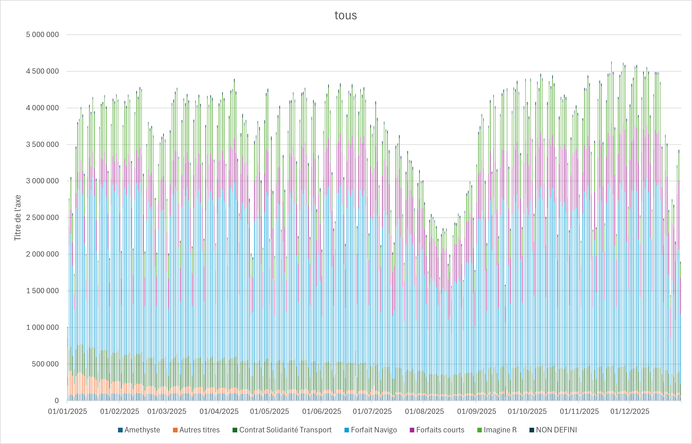
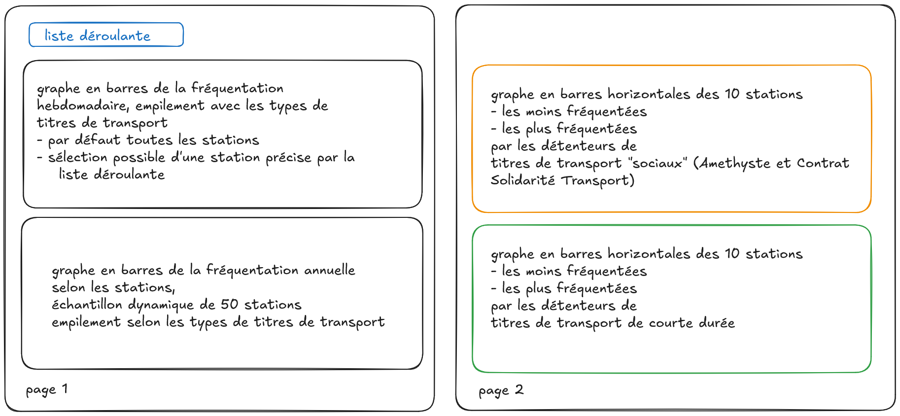

**********************
VERSION FONCTIONNELLE

> [!IMPORTANT]
> Requirement : openpyxl==3.1.3

** usage : `uv run metro` **

- un fichier `data_traitee.xlsx` doit être présent dans le dossier d'où est appelé le script. Il correspond au dataset nettoyé : [https://minio.lab.sspcloud.fr/jacquemmoz/partage/data_traitee.xlsx]
- un fichier `sortie.xlsx` est généré dans le dossier d'où est appelé le script.

*en cours d'implémentation : dossier `artefacts` et connexion MinIO au dépôt S3.*
**********************

> tree

L'objectif est d'étudier la fréquentation des stations de métro du métro parisien, à partir de données fournies par Île-de-France Mobilités [https://prim.iledefrance-mobilites.fr/fr], en les représentant sur un tableau de bord.

- Quelle est l'évolution selon le temps ?
- Quelles sont les différences de fréquentation entre les stations ?

On va s'appuyer sur les **données de validation sur le réseau ferré** : elles comptent pour chaque *station* (appelée *arrêt*) le nombre de valiations par jour, correspondant donc aux **entrées dans la station**, catégorisées par *type de titre de transport*.
Limites :
- pas de données sur les tickets sur support papier (support en extinction),
- évidemment pas de données sur les voyageurs n'ayant pas pu valider ou fraudeurs,
- pour les stations ayant eu entre 1 et 5 validations journalières pour un type de titre donnée, les données indiquent "MOINS DE 5".

# Données sources
## Jeu de données

[https://prim.iledefrance-mobilites.fr/]
Validations sur le réseau ferré en 2025
"Ce jeu de données présente le nombre de validations des voyageurs par jour par arrêt et par titre de transport sur le réseau ferré."
Licence : Licence ODbL Version Française [https://spdx.org/licenses/ODbL-1.0.html#licenseText] (spécifique aux bases de données)
Producteur : Île-de-France Mobilités
Documentation : [https://eu.ftp.opendatasoft.com/stif/Validations/Documentation/Donnees_de_validation.pdf]
La masse fait qu'elles sont séparées en quatre fichiers de données trimestrielles :

- 1er trimestre [https://prim.iledefrance-mobilites.fr/fr/jeux-de-donnees/validations-reseau-ferre-nombre-validations-par-jour-1er-trimestre]
	- Dernier traitement (données) : 23 juillet 2025 9:44
	- Dernier traitement (métadonnées) : 29 décembre 2025 11:57
- 2e trimestre [https://prim.iledefrance-mobilites.fr/fr/jeux-de-donnees/validations-reseau-ferre-nombre-validations-par-jour-2eme-trimestre]
	- Dernier traitement (données) : 28 août 2025 14:20
	- Dernier traitement (métadonnées) : 29 décembre 2025 11:57
- 3e trimestre [https://prim.iledefrance-mobilites.fr/fr/jeux-de-donnees/validations-reseau-ferre-nombre-validations-par-jour-3eme-trimestre]	
	- Dernier traitement (données) : 27 novembre 2025 11:12
	- Dernier traitement (métadonnées) : 29 décembre 2025 11:56
 -4e trimestre [https://prim.iledefrance-mobilites.fr/fr/jeux-de-donnees/validations-reseau-ferre-nombre-validations-par-jour-4eme-trimestre]
	- Dernier traitement (données) : 11 mars 2026 9:44
	- Dernier traitement (métadonnées) : 11 mars 2026 9:44

## Dictionnaire des données

|   VARIABLE      | FORMAT            | DEFINITION                                          |
| --------------- | ----------------- | --------------------------------------------------- |
| JOUR 	          | Date (01/01/2015) | Jour d’exploitation (de 04:00 à 03:59 le lendemain) |
| COD_STIF_TRNS   | Numérique         | Code Stif du transporteur							|
| COD_STIF_RES    | Numérique 		  | Code Stif du réseau									|
| COD_STIF_ARRET  | Numérique 		  | Code Stif de l’arrêt/station						|
| LIBELLE_ARRET   | Caractère 		  | Libellé de l’arrêt/station							|
| ID_REFA_LDA     | Caractère         | Identifiant arrêt référentiel STIF					|
| CATEGORIE_TITRE | Caractère         | Titre de transport									|
| NB_VALD         | Numérique         | Nombre de validations (en entrée sur le réseau)		|

On s'intéresse à la *RATP*, COD_STIF_TRNS 100, réseau métro, COD_STIF_RES 110.

## Nettoyage mise en forme et exploration des données

Ces opérations sont décrites et exécutables dans le notebook `exploration.ipynb` (dossier `notebooks`).

On obtient le fichier **`data_traitee.xlsx`, jeu de données mis en forme**, de la forme suivante :

| jour                | libelle_arret | categorie_titre | nb_vald |
| ------------------- | ------------- | --------------- | ------- |
| 2025-06-29 00:00:00 | SIMPLON       | Forfait Navigo  | 2764    |

> Il est stocké dans le dépôt [https://minio.lab.sspcloud.fr/jacquemmoz/partage/data_traitee.xlsx].

# Traitements envisagés et maquette

La seule donnée quantitative est la nombre de validations.
Les variables catégorielles sont : date, station et categorie titre. La date est par ailleurs une variable ordinale.
On peut donc aisément envisager de stratifier le **nombre de validations par titre de transport** (barres empilées) **selon la date ou la station**.

*Première maquette du tableau de bord envisagé*

> On réalise des simulations à partir du jeu de données sur Excel avec des *graphiques croisés dynamiques*.

On souhaiterait indiquer les stations sur un plan de métro, les points étant dynamiquement placés. Le jeu de données *Coordonnées des stations sur le plan schématique RATP* fourni par data.gouv.fr le permettrait ([https://www.data.gouv.fr/datasets/coordonnees-des-stations-sur-le-plan-schematique-ratp-ratp]).

*Deuxième maquette du tableau de bord envisagé*

Il n'est malheureusement pas possible de télécharger ce jeu de données, forçant à abandonner cette idée.

Les simulations montrent, logiquement, la baisse du nombre de validations les week-ends :

*Fréquentation des stations de métro par jour : on voit nettement la baisse de fréquentation les week-ends.*

Ce fait logique n'apporte aucune information, par ailleurs la représentation des données avec une granulométrie quotidienne génère un graphe trop chargé. On retiendra donc une **granulométrie hebdomadaire**, qui résoudra ces deux problèmes.

Le nombre important de stations (319) génère également un graphe trop chargé. On présentera donc un **échantillon de 50 stations tirées *dynamiquement* au sort**.

**Enfin, on relève des différences de répartition des types de titres de transport selon les stations, que nous devons mettre en évidence sur le tableau de bord.** Nous étudierons les **titres de transports attribus sur critères sociaux (agrégeant "Amethyste" et "Contrat Solidarité Transport")** et les **Forfaits courts**.

> Titres de transports attribus sur critères sociaux = Amethyste + Contrat Solidarité Transport

La fréquentation temporelle sera par défaut présentée pour le total des stations, une liste déroulante permettra de sélectionner une station précise.

*Maquette définitive du tableau de bord*

# Mise en oeuvre effective des traitements

Le fichier Excel calculant et affichant le tableau de bord est généré par des scripts Python, à partit des données traitées `data_traitee.xlsx` générées par le notebook `exploration.ipynb`.

## Organisation des scripts Python

> **`uv run metro`**

Les données traitées sont passées au script `main.py`, qui les recopie dans la feuille `DATA` du classeur de sortie, et orchestre sa création. Il appelle successivement les scripts `feuilles.py`, `graphes1.py` et `graphes2.py`, responsables respectivement de la génération des feuilles de calcul et des deux feuilles constituant le tableau de bord. Le script `forme.py` contient les éléments de mise en forme des graphes, afin de séparer, dans le projet, la forme du contenu. Le tableau de bord est généré sous forme d'un fchier `sortie.xlsx`.

**Les différents fichiers contiennent des commentaires explicatifs, et les focntions appelées sont dotées de *docstrings*.**

## Organisation du classeur contenant le tableau de bord

*Dans les paragraphes suivants, les formules Excel seront indiquées en français, telles qu'elles apparaitront dans le fichier généré. Dans les scripts, elles sont traitées en anglais, conformément aux spécifications du package* Openpyxl *, qui est utilisé pour traiter les fichiers Excel.*

### Feuille `DATA`

Elle correspond à la copie des données traitées, auxquelles sont ajoutées une colonne correspondant au numéro de la semaine : `=NO.SEMAINE()`.

### Feuille `modalites`

Elle contient une colonne présentant l'ensemble des stations de métro, suivi de la valeur "toutes". Elle sert de référence à la liste déroulante de sélection du nom de station dans la feuille `Graphe1`.

*Elle contient également la liste des différents types de titres de transport, qui n'est pas utilisée mais est présente pour permettre de futures évolutions du tableau de bord.*

*Cette feuille est statique, générée directement en Python, donc sans formules Excel. Le recours à la formule =UNIQUE() e été testé (avec calcul de la plage dynamique de l'ArrayFormula) mais non retenu : voir #6 .*

### Feuille `jours`

*Cette feuille a été calculée lors du prototypage du tableau de bord, avant que l'on décide d'une granulométrie hebdomadaire. Elle est maintenue dans le classeur pour de futuregit branchs évolutions. Elle permet également d'illustrer la logique des calculs dans le classeur.*

Cette feuille pivote des données de `DATA` selon la date des jours, en ajoutant les nombres de validations, en utilisant un ensemble de formule de la forme :

`=SOMME.SI.ENS(DATA!$D:$D;DATA!$A:$A;$A2;DATA!$B:$B;SI(station="toutes";"*";station);DATA!$C:$C;B$1)`

Par exemple pour la cellule B2 :

- somme selon la colonne $D:$D `nb_vald`,
- pour la date égale à la valeur contenue dans l'entête de ligne (dans l'exemple cellule $A2),
- pour la station indiquée dans la valeur de la cellule nommée 'station' (cellule avec une liste déroulante présente dans la feuille `Graphes1`), en traitant le cas où l'affichage de toutes les stations est demandé, 
- pour le type de titre de transport égal à la valeur contenue dans l'entête de la colonne (dans l'exemple cellule B$1).

### Feuille `semaines`

Cette feuille pivote les données de `DATA` selon la même logique que la feuille `jours`, mais selon le numéro de la semaine. Le premier critère de la somme conditionnelle sera donc non plus la colonne `jour`, mais la colonne `semaine` :

`=SOMME.SI.ENS(DATA!$D:$D;DATA!$E:$E;$A2;DATA!$B:$B;SI(station="toutes";"*";station);DATA!$C:$C;B$1)`

### Feuille `stations`

Ici le pivot est fait non plus selon une date, mais selon la station (`libelle_arret`, colonne B), indiquée en entête de ligne :

`=SOMME.SI.ENS(DATA!$D:$D;DATA!$B:$B;$A2;DATA!$C:$C;B$1)`

Des colonnes supplémentaires sont calculées :
- `aleatoire=ALEA()` : valeur aléatoire qui servira pour l'écantillonnage dans l'onglet `echantillon`,
- `prop_social=(B2+D2)/SOMME(B2:H2)` : proportion de titres de transports "sociaux" ;
- `prop_court==(F2+D2)/SOMME(B2:H2)` : proportion de titres de transport courts.

Ces deux dernières colonnes permmettent de générer les plages qui permettront la représentation des stations les plus et les moins fréquentées par les détenteurs de titres de transport "sociaux" et courts. Ces plages sont matérialisées par l'aggrégation des lignes correspondant aux 10 plus fortes et plus faibles valeurs des colonnes de proportions, grâce aux formules :

`=PRENDRE(TRIER($A$2:$J$319;10;-1;);10)` et
`=PRENDRE(TRIER($A$2:$J$319;10;-1;);-10)`

Sont ajoutées à ces plages des colonnes `top` et `flop` reprenant les valeurs de la colonne proportion qui appartiendront respectivement aux séries des stations les plus et les moins fréquentées.

### Feuille `echantillon`

Cette feuille contient un tirage aléatoire des fréquentations de 50 stations issues de la feuille `stations` selon les 50 plus faibles valeurs contenue dans la colonne `aleatoire`) :

`=PRENDRE(TRIERPAR(stations!A:H;stations!I:I);50)`

# Perpectives

- forfaits courts vs Navigo/ImaginR
	
- titre spécial 21/6 (début année : titres papier ?)

- cartographie
